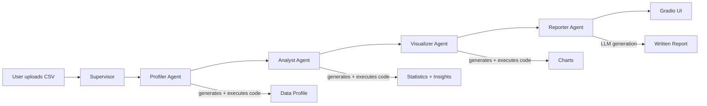

# AI Data Analyst Agent

Multi-agent data analysis system powered by LangGraph and Claude. Upload a CSV file and a team of AI agents collaboratively produces a comprehensive analysis.


## Architecture



## What Each Agent Does

| Agent | Role | Method |
|-------|------|--------|
| **Profiler** | Data shape, types, missing values, distributions | Generates + executes Python code |
| **Analyst** | Correlations, outliers, group-by analysis, key findings | Generates + executes Python code |
| **Visualizer** | Histograms, heatmaps, bar charts, scatter plots | Generates + executes matplotlib code |
| **Reporter** | Executive summary, findings, recommendations | LLM text generation |

## Quick Start

```bash
git clone https://github.com/Thejas2003gowda/data-analyst-agent.git
cd data-analyst-agent
python3.11 -m venv venv
source venv/bin/activate
pip install -r requirements.txt
echo "ANTHROPIC_API_KEY=your-key" > .env
python app/gradio_app.py
```

Open http://localhost:7860, upload a CSV, click Analyze.

## Tech Stack

| Component | Technology |
|-----------|-----------|
| Agent Framework | LangGraph |
| LLM | Claude (Anthropic API) |
| Code Execution | Python subprocess (sandboxed) |
| Visualization | matplotlib, seaborn |
| Frontend | Gradio |
| Testing | pytest (6/6 passing) |
| CI/CD | GitHub Actions |

## Project Structure
data-analyst-agent/
|-- src/
|   |-- agents/
|   |   |-- profiler.py         # Data profiling agent
|   |   |-- analyst.py          # Statistical analysis agent
|   |   |-- visualizer.py       # Chart generation agent
|   |   |-- reporter.py         # Report writing agent
|   |-- tools/
|   |   |-- code_executor.py    # Safe Python execution
|   |   |-- file_handler.py     # CSV loading and validation
|   |-- graph.py                # LangGraph workflow
|   |-- state.py                # Shared agent state
|-- app/
|   |-- gradio_app.py           # Gradio frontend
|-- tests/
|   |-- test_tools.py           # Unit tests (6/6 passing)
|-- .github/workflows/ci.yml
|-- requirements.txt
|-- README.md

## Example Output

Upload any CSV and the system produces:
- **Data Profile**: Shape, types, missing values, descriptive statistics
- **Statistical Analysis**: Correlations, outlier detection, group-by summaries, key findings
- **Visualizations**: 4 auto-generated charts (distribution, heatmap, bar, scatter)
- **Report**: Executive summary, numbered insights, actionable recommendations

## Key Design Decisions

- **LangGraph over CrewAI**: Explicit graph-based control flow is more deterministic and debuggable than role-based delegation
- **Code execution over direct pandas**: Agents generate and run Python code, making the system flexible for any dataset structure
- **Retry logic**: Each agent retries up to 3 times with error feedback, enabling self-correction
- **Modular agents**: Each agent is independently testable and replaceable

## License

MIT
